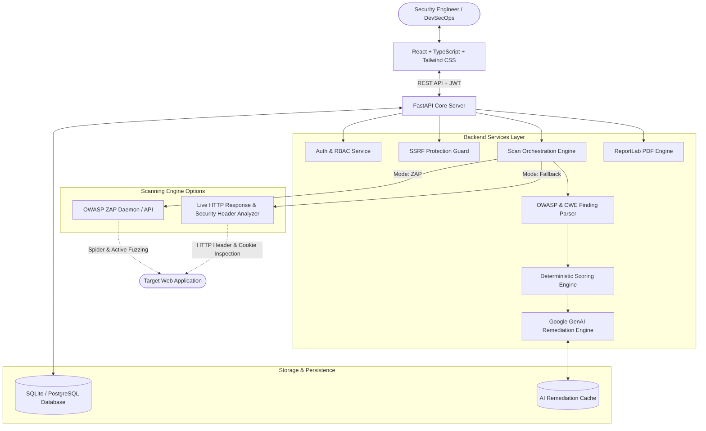
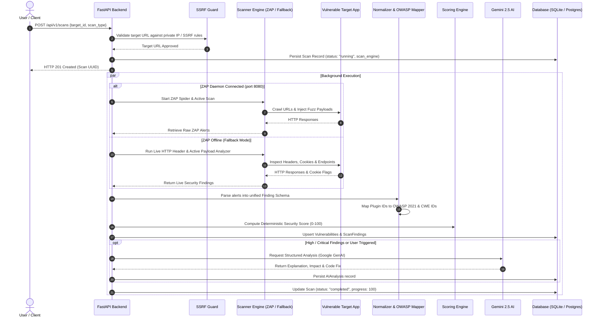

# Cyvera System Architecture & Technical Design

## 1. System Overview

**Cyvera** is an automated web security assessment platform that orchestrates vulnerability scanning, deterministic risk calculation, OWASP Top 10 / CWE classification, and AI-guided remediation workflows.



---

## 2. Scanning Pipeline & Data Flow



---

## 3. Core Subsystems

### 3.1 Dual-Mode Scanning Architecture
Cyvera natively supports two scanning engines to maximize flexibility across cloud, Docker, and bare-metal environments:

1. **OWASP ZAP Engine (`scan_engine: "zap"`):**
   - Interfaces with the official OWASP ZAP REST API on port `8080`.
   - Automates multi-stage assessments:
     - **Spider Phase:** Discovers endpoints, parameters, and form fields (`/JSON/spider/action/scan/`).
     - **Passive Rule Phase:** Analyzes traffic streams without mutating payloads.
     - **Active Scanner Phase:** Fuzzes inputs for SQLi, XSS, Path Traversal, and SSRF (`/JSON/ascan/action/scan/`).
   - Retrieves alerts via `/JSON/core/view/alerts/`.

2. **Live HTTP & Active Fallback Engine (`scan_engine: "fallback"`):**
   - Activated seamlessly when ZAP daemon is not reachable.
   - Inspects real live target HTTP responses:
     - `Content-Security-Policy` presence and directive restrictions.
     - `X-Frame-Options` anti-clickjacking headers.
     - `X-Content-Type-Options: nosniff` MIME protection.
     - `Strict-Transport-Security` (HSTS) enforcement over HTTPS.
     - Insecure Cookie flags (`HttpOnly`, `Secure`, `SameSite`).
     - Server version leakage (`Server` header banner disclosure).
   - Generates active validation test cases against reflected injection parameters.

---

### 3.2 Deterministic Risk Scoring Formula

Cyvera calculates security posture scores using a deterministic mathematical deduction model (Score range: `0 – 100`):

$$\text{Security Score} = \max\left(0, 100 - \sum_{i=1}^{N} \text{Penalty}(\text{Severity}_i)\right)$$

#### Severity Penalty Weights:
- **Critical:** `-35` points (Immediate compromise, RCE, auth bypass)
- **High:** `-20` points (Direct injection, XSS, SQLi, CSRF on sensitive endpoints)
- **Medium:** `-10` points (Missing CSP, clickjacking, insecure CORS)
- **Low:** `-4` points (Missing HttpOnly cookie flag, missing MIME headers)
- **Informational:** `-1` point (Server version disclosure, verbose headers)

#### Posture Classification Bands:
- `80 – 100`: **Secure / Good** (Low exposure)
- `60 – 79`: **Moderate Risk** (Remediation recommended)
- `0 – 59`: **High / Critical Risk** (Immediate action required)

---

### 3.3 OWASP Top 10 & CWE Mapping Engine

Raw scanner findings are normalized into standardized taxonomies:
- **A01:2021-Broken Access Control** (`CWE-22`, `CWE-639`)
- **A02:2021-Cryptographic Failures** (`CWE-319`, `CWE-326`)
- **A03:2021-Injection** (`CWE-79` XSS, `CWE-89` SQLi, `CWE-78` Command Injection)
- **A05:2021-Security Misconfiguration** (`CWE-693` CSP, `CWE-1021` Clickjacking, `CWE-16`, `CWE-1004`, `CWE-200`)
- **A07:2021-Identification and Authentication Failures** (`CWE-384`, `CWE-287`)

---

### 3.4 AI Remediation Engine (Google GenAI)

Powered by the official modern `google.genai` SDK and `gemini-2.5-flash`:
- Generates contextual developer fix snippets tailored to specific frameworks (FastAPI, Express.js, Nginx, Django).
- Synthesizes risk explanations, business impacts, and step-by-step defensive guidelines.
- Caches AI output per finding in the `ai_analyses` table to avoid redundant LLM invocations.

---

### 3.5 Security Controls & Hardening

1. **SSRF Protection (`ssrf_guard.py`):**
   - Resolves DNS hostnames and verifies target IP addresses against private/reserved ranges (`10.0.0.0/8`, `172.16.0.0/12`, `192.168.0.0/16`, `127.0.0.0/8`, `169.254.169.254`).
   - Configurable `ALLOW_LOCAL_TARGETS=True` for sandboxed development/testbed scanning.
2. **Authentication & Password Hashing:**
   - Cryptographic hashing via `bcrypt`.
   - Stateless JWT tokens (HS256) with expiration and role verification.
3. **API Rate Limiting:**
   - Enforced across endpoints via `slowapi` to protect against brute-force and resource exhaustion.

---

## 4. Database Entity-Relationship Schema

```
+------------------+       +-------------------+       +-----------------------+
|     targets      | 1   * |       scans       | 1   * |     scan_findings     |
+------------------+-------+-------------------+-------+-----------------------+
| id (UUID) [PK]   |       | id (UUID) [PK]    |       | id (UUID) [PK]        |
| user_id [FK]     |       | target_id [FK]    |       | scan_id [FK]          |
| name             |       | user_id [FK]      |       | vulnerability_id [FK] |
| url              |       | scan_type         |       | severity              |
| description      |       | scan_engine       |       | risk_score            |
| is_active        |       | status            |       | affected_url          |
| created_at       |       | progress          |       | http_method           |
+------------------+       | security_score    |       | parameter             |
                           | created_at        |       | evidence              |
                           +-------------------+       | created_at            |
                                                       +-----------------------+
                                                                   | 1
                                                                   |
                                                                   | 1
                                                       +-----------------------+
                                                       |     ai_analyses       |
                                                       +-----------------------+
                                                       | id (UUID) [PK]        |
                                                       | finding_id [FK]       |
                                                       | explanation           |
                                                       | potential_impact      |
                                                       | remediation           |
                                                       | fix_guidance          |
                                                       | model_version         |
                                                       | created_at            |
                                                       +-----------------------+
```
