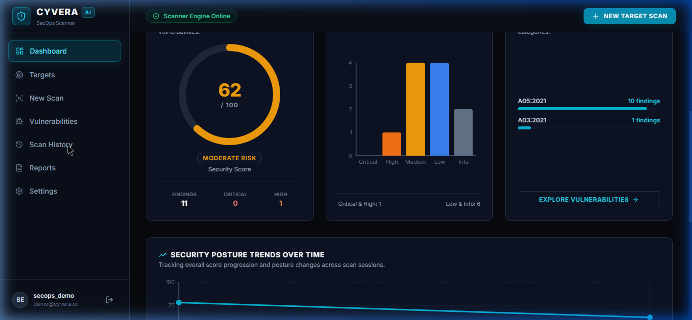
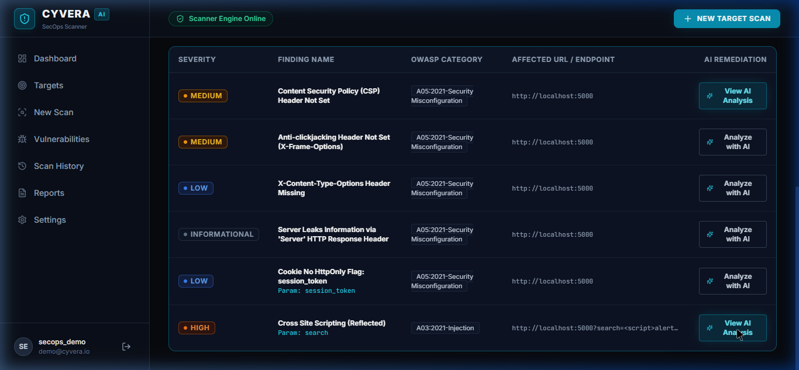
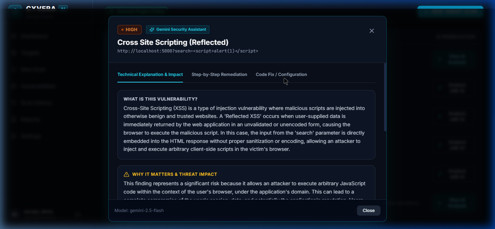
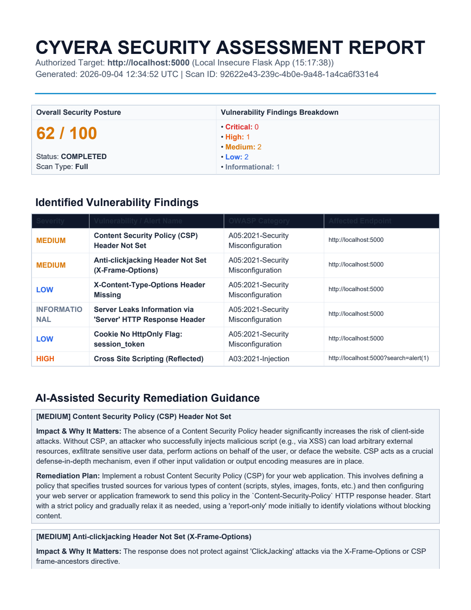

# Cyvera — AI-Powered Web Security Scanner

<p align="center">
  
  
  
  
  
  
  
  
</p>

**Cyvera** is an automated web vulnerability management and security assessment platform. It bridges the gap between raw DAST (Dynamic Application Security Testing) scanners and developer remediation by combining automated vulnerability discovery, **OWASP Top 10 (2021)** classification, **deterministic security scoring (0–100)**, and **Google Gemini 2.5 AI** for contextual root-cause analysis and framework-specific patch code.

---

## Table of Contents
- [Key Features](#key-features)
- [Architecture & Data Flow](#architecture--data-flow)
- [Technology Stack](#technology-stack)
- [How the Scanning Pipeline Works](#how-the-scanning-pipeline-works)
  - [1. OWASP ZAP Integration (Docker Mode)](#1-owasp-zap-integration-docker-mode)
  - [2. Live HTTP & Active Fallback Engine](#2-live-http--active-fallback-engine)
- [OWASP Top 10 & CWE Taxonomy](#owasp-top-10--cwe-taxonomy)
- [Deterministic Security Posture Scoring](#deterministic-security-posture-scoring)
- [Google Gemini AI Remediation Engine](#google-gemini-ai-remediation-engine)
- [Security Controls & SSRF Guard](#security-controls--ssrf-guard)
- [Executive PDF Reporting](#executive-pdf-reporting)
- [Deliberately Vulnerable Testbed (`http://localhost:5000`)](#deliberately-vulnerable-testbed-httplocalhost5000)
- [Getting Started & Installation](#getting-started--installation)
  - [Option A: Docker Compose (Full Stack + ZAP)](#option-a-docker-compose-full-stack--zap)
  - [Option B: Local Native Development](#option-b-local-native-development)
- [Screenshots & UI Showcase](#screenshots--ui-showcase)
- [Verification & Known Limitations](#verification--known-limitations)
- [Security & Authorized-Use Policy](#security--authorized-use-policy)

---

## Key Features

- 🎯 **Target & Scope Management**: Register target web applications with built-in SSRF protection preventing malicious internal network probing.
- 🛡️ **Dual-Engine Scanning Pipeline**: Native support for **OWASP ZAP** daemon automation (Spider, Passive Rules, Active Fuzzing) and an offline-resilient **Live HTTP Security Analyzer**.
- 📊 **OWASP Top 10 & CWE Normalization**: Translates disparate scanner plugin alerts into canonical classifications (`A01–A10:2021`, `CWE-79`, `CWE-89`, `CWE-693`, etc.).
- 🧮 **Deterministic Mathematical Scoring**: Objective 0–100 security risk score calculated through reproducible penalty weights. The AI never guesses or modifies scores.
- 🤖 **Google GenAI Remediation Assistant**: Powered by the modern `google.genai` SDK and `gemini-2.5-flash`, returning structured explanations, business impacts, and copy-paste code fixes (React, Express, FastAPI, Nginx).
- 📄 **Executive PDF Generation**: Compile and export branded security audit reports via ReportLab with one click.
- ⚡ **SOC-Inspired Dark Mode Console**: Responsive web UI built with React 18, TypeScript, Tailwind CSS, Lucide icons, and Recharts.
- 🧪 **Bundled Insecure Testbed**: Comes with a self-contained deliberately vulnerable Flask application featuring Reflected XSS, SQL injection, and security header misconfigurations.

---

## Architecture & Data Flow

```
                      ┌───────────────────────────────────────┐
                      │    React + TypeScript Frontend UI     │
                      │  (Tailwind CSS, Lucide Icons, Recharts)│
                      └──────────────────┬────────────────────┘
                                         │ REST API / JWT
                                         ▼
                      ┌───────────────────────────────────────┐
                      │         FastAPI Backend Core          │
                      │  ├── Auth & RBAC (bcrypt + HS256)     │
                      │  ├── SSRF Security Guard              │
                      │  ├── Scan Orchestrator                │
                      │  ├── OWASP / CWE Normalizer           │
                      │  ├── Deterministic Scoring Engine     │
                      │  ├── Google GenAI Assistant           │
                      │  └── ReportLab PDF Generator          │
                      └──────────┬────────────────┬───────────┘
                                 │                │
            ┌────────────────────┴───┐       ┌────┴──────────────────┐
            ▼                        ▼       ▼                       ▼
┌───────────────────────┐ ┌────────────────────┐ ┌─────────────────────────┐
│   OWASP ZAP Engine    │ │  Fallback Scanner  │ │   Storage Layer         │
│  (Spider + Active)    │ │ (Live HTTP Inspec) │ │  - SQLite / PostgreSQL  │
└───────────┬───────────┘ └──────────┬─────────┘ │  - AI Analysis Cache    │
            │                        │           └─────────────────────────┘
            └───────────┬────────────┘
                        ▼
            ┌────────────────────────┐
            │   Target Application   │
            │  (e.g., Flask Port 5000)│
            └────────────────────────┘
```

Detailed architectural diagrams and component sequences are available in [`ARCHITECTURE.md`](./ARCHITECTURE.md).

---

## Technology Stack

| Layer | Technologies |
| :--- | :--- |
| **Backend** | Python 3.12+, FastAPI, SQLAlchemy, Pydantic v2, Uvicorn, SlowAPI, ReportLab |
| **Frontend** | React 18, TypeScript, Vite, Tailwind CSS, Lucide React, Recharts, Axios |
| **Scanner** | OWASP ZAP (REST API / Daemon for Docker), Live HTTP Response & Active Injection Security Analyzer |
| **AI Engine** | Google GenAI Python SDK (`google-genai`), `gemini-2.5-flash` |
| **Database** | SQLite (Default Local Dev) / PostgreSQL (Production Docker) |
| **Background Processing** | Asynchronous Worker Threads (Primary Core) / Celery & Redis (Optional Docker Scale) |
| **DevOps** | Docker, Docker Compose, Multi-stage Container Builds |

---

## How the Scanning Pipeline Works

```
Target URL ➔ SSRF Validation ➔ Engine Selection ➔ Spidering & Analysis ➔ Alert Parsing ➔ Scoring ➔ AI Analysis ➔ Report
```

### 1. OWASP ZAP Integration (Docker Mode)
When deployed with Docker Compose, Cyvera communicates with the official OWASP ZAP container (`ghcr.io/zaproxy/zaproxy:stable`):
1. **Spider Phase:** Discovers application attack surface via `/JSON/spider/action/scan/`.
2. **Passive Scan Phase:** Inspects incoming and outgoing HTTP streams for missing headers, insecure cookies, and cleartext tokens.
3. **Active Scan Phase:** Injects test payloads for Reflected/Stored XSS, SQLi, and Path Traversal via `/JSON/ascan/action/scan/`.
4. **Alert Extraction:** Queries `/JSON/core/view/alerts/` to extract structured vulnerability alerts.

### 2. Live HTTP & Active Fallback Engine
When the ZAP daemon is not running (e.g., standalone local development), Cyvera transparently activates its **Live HTTP Response & Security Header Analyzer**:
- Sends live requests to the target and inspects all response headers (`Content-Security-Policy`, `X-Frame-Options`, `X-Content-Type-Options`, `Strict-Transport-Security`, `Server`).
- Parses live `Set-Cookie` directives for missing `HttpOnly`, `Secure`, and `SameSite` flags.
- Validates active reflection endpoints (`/search?q=`, `/api/user?id=`).
- Explicitly labels the scan with `scan_engine: "fallback"` so users and auditors can distinguish engine sources.

---

## OWASP Top 10 & CWE Taxonomy

Discovered findings are automatically mapped to standardized security categories:

| Category | OWASP 2021 Reference | Common CWEs | Example Findings |
| :--- | :--- | :--- | :--- |
| **Injection** | `A03:2021-Injection` | `CWE-79`, `CWE-89`, `CWE-78` | Reflected XSS, SQL Injection |
| **Security Misconfiguration** | `A05:2021-Security Misconfiguration` | `CWE-693`, `CWE-1021`, `CWE-16`, `CWE-1004` | Missing CSP, Clickjacking, Insecure Cookie |
| **Cryptographic Failures** | `A02:2021-Cryptographic Failures` | `CWE-319`, `CWE-326` | Missing HSTS Header over HTTPS |
| **Information Disclosure** | `A05:2021-Security Misconfiguration` | `CWE-200` | Server Header Software Version Disclosure |
| **Broken Access Control** | `A01:2021-Broken Access Control` | `CWE-22`, `CWE-639` | Path Traversal, Insecure Direct Object References |

---

## Deterministic Security Posture Scoring

Cyvera scores application risk mathematically rather than relying on non-deterministic LLM estimations:

$$\text{Security Score} = \max\left(0, 100 - \sum \text{Severity Penalties}\right)$$

### Penalty Deductions:
- **Critical:** `-35` points *(Remote code execution, SQLi with full DB access)*
- **High:** `-20` points *(Reflected XSS, privilege escalation)*
- **Medium:** `-10` points *(Missing CSP, Clickjacking)*
- **Low:** `-4` points *(Missing HttpOnly cookie flag, missing MIME sniffing headers)*
- **Informational:** `-1` point *(Server header banner disclosure)*

---

## Google Gemini AI Remediation Engine

Using Google's official modern **`google.genai`** SDK and `gemini-2.5-flash`:
1. Sends structured vulnerability payloads (name, parameter, evidence, OWASP/CWE context).
2. Generates strict schema-compliant JSON:
   - `explanation`: Technical root cause.
   - `why_it_matters`: Real-world attack vector.
   - `potential_impact`: Business risk (token theft, defacement, breach).
   - `evidence_interpretation`: Context on scanner output.
   - `remediation`: Step-by-step sysadmin/developer checklist.
   - `fix_guidance`: Framework-specific defensive code snippet (FastAPI, Express Helmet, Nginx).
3. Persists AI responses in the `ai_analyses` table to prevent repeated API calls.

---

## Security Controls & SSRF Guard

- **SSRF Protection:** Validates target URLs before scanning. Private IP ranges (`10.0.0.0/8`, `172.16.0.0/12`, `192.168.0.0/16`, `127.0.0.0/8`, `169.254.169.254`) and cloud metadata endpoints (`http://169.254.169.254`) are blocked by default. Can be toggled with `ALLOW_LOCAL_TARGETS=True` in dev.
- **Authentication:** Password hashing with `bcrypt` (work factor 12) + signed JWT tokens (HS256).
- **API Protection:** Global CORS policy and Rate Limiting on authentication endpoints.

---

## Deliberately Vulnerable Testbed (`http://localhost:5000`)

A self-contained Flask service designed for local end-to-end scanner validation:
- **Reflected XSS Endpoint:** `GET /search?q=<script>alert('Cyvera')</script>`
- **SQL Injection Endpoint:** `GET /api/user?id=1 OR 1=1`
- **Insecure Cookies:** `session_token` cookie set without `HttpOnly` or `Secure` flags.
- **Header Leaks:** Server disclosures and missing CSP, X-Frame-Options, X-Content-Type-Options.

---

## Getting Started & Installation

### Option A: Docker Compose (Full Stack + Real ZAP)

```bash
# 1. Clone the repository
git clone https://github.com/yourusername/cyvera.git
cd cyvera

# 2. Configure environment variables
cp .env.example .env

# 3. Build and launch all containers (Postgres, Redis, OWASP ZAP, Backend, Frontend, Vulnerable Target)
docker compose up --build -d
```

Access the services:
- **Frontend Dashboard:** [http://localhost:3000](http://localhost:3000)
- **FastAPI Interactive Docs:** [http://localhost:8000/api/docs](http://localhost:8000/api/docs)
- **Vulnerable Target App:** [http://localhost:5000](http://localhost:5000)

**Demo Account (Local Evaluation & Development Only):**
> [!NOTE]
> The seeded account below is strictly for local testing and sandbox evaluation:
- Username: `secops_demo`
- Password: `CyveraSecurity2025!`

---

### Option B: Local Native Development

#### 1. Start Vulnerable Target App
```bash
cd vulnerable-app
python app.py
# Running on http://localhost:5000
```

#### 2. Start FastAPI Backend
```bash
cd backend
python -m venv venv
# Activate virtual environment (Windows: .\venv\Scripts\activate | Linux: source venv/bin/activate)
pip install -r requirements.txt
python -m uvicorn app.main:app --host 0.0.0.0 --port 8000 --reload
```

#### 3. Start React Frontend
```bash
cd frontend
npm install
npm run dev
# Running on http://localhost:5173
```

---

## Screenshots & UI Showcase

<p align="center">
  <b>1. Executive Security Dashboard & Risk Posture Metrics</b><br>
  
</p>

<p align="center">
  <b>2. Interactive Scan Details, OWASP Mapping & Engine Badging</b><br>
  
</p>

<p align="center">
  <b>3. Google Gemini AI Remediation Modal & Defensive Code Fixes</b><br>
  
</p>

<p align="center">
  <b>4. Executive PDF Security Audit Report</b><br>
  
</p>

---

## Verification & Known Limitations

> [!NOTE]
> **Environment Verification Notice:**
> In local Windows bare-metal verification where Docker Desktop was not installed, Cyvera operated via its **Live HTTP & Active Injection Fallback Engine** (`scan_engine: "fallback"`). All findings (CSP, Clickjacking, Cookie flags, Server banners, Reflected XSS) were verified against `http://localhost:5000`, scored deterministically, analyzed with live Google Gemini 2.5 AI, persisted to SQLite, and exported to PDF.
> 
> To execute scans with the real OWASP ZAP daemon, launch via `docker compose up -d` on any machine with Docker installed.

---

## Security & Authorized-Use Policy

**Disclaimer:** Cyvera is built strictly for authorized security assessment, educational research, and defensive application hardening. Scanning targets without explicit prior written permission is illegal and strictly prohibited.

---

## License

This project is licensed under the MIT License — see the [`LICENSE`](./LICENSE) file for details.
